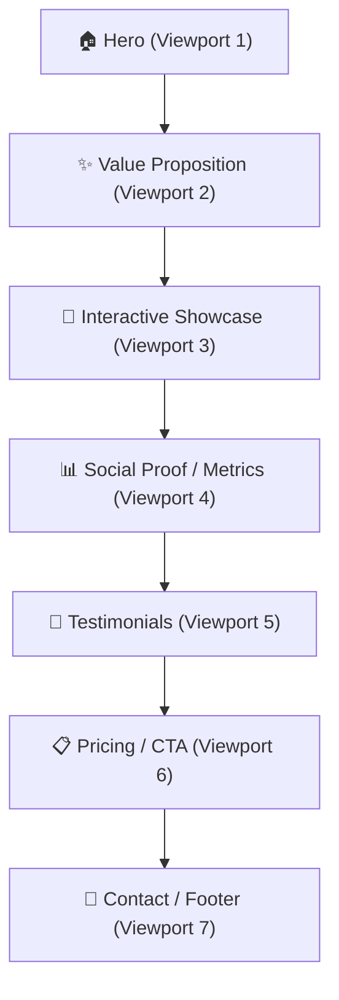

# Premium 3D Animated Website — Complete Operating System Spec

> **Purpose:** A structured specification for building premium, performance-optimized, accessible 3D animated websites. Hand this directly to an AI coding agent for implementation.

## How to Use This Skill

1. **New 3D website project:** Follow the Implementation Roadmap (§8) sequentially — Phase 1 through Phase 6.
2. **Adding 3D to an existing site:** Cherry-pick relevant sections (e.g., §3 for 3D system, §4 for animations).
3. **Component implementation:** Reference specific sections when building (e.g., "Implement the Button component following §4.3 micro-interactions").
4. **Quality assurance:** Use §9 Quality Gates as your pre-launch checklist.

---

## 1. Information Architecture

### 1.1 Content Hierarchy



| Section | Purpose | 3D Element | Scroll Depth |
|---------|---------|------------|--------------|
| **Hero** | Capture attention in < 3s | Full-scene 3D model, floating particles | 0–100vh |
| **Value Prop** | Communicate core benefit | Animated icon morphing | 100–200vh |
| **Showcase** | Demonstrate product/service | Interactive 3D carousel or exploded-view | 200–400vh |
| **Social Proof** | Build trust | Counter animations with 3D depth | 400–500vh |
| **Testimonials** | Validate claims | Card stack with parallax depth | 500–600vh |
| **Pricing/CTA** | Drive conversion | Glowing CTA with hover depth effect | 600–700vh |
| **Footer** | Secondary navigation | Subtle particle field | 700vh+ |

### 1.2 Navigation Model

- **Desktop:** Fixed glassmorphic header with horizontal nav, scroll-spy highlighting active section, CTA button right-aligned.
- **Mobile:** Hamburger → fullscreen overlay menu with staggered entrance animations.
- **Scroll indicator:** Progress bar or dot-nav on right edge (desktop only).

---

## 2. Visual Identity System

### 2.1 Color Palette

```scss
// ─── Core Palette ───
$color-void:        #0A0A0F;    // Primary background — near-black with blue undertone
$color-surface:     #12121A;    // Card/surface background
$color-surface-alt: #1A1A2E;    // Elevated surface
$color-glass:       rgba(255, 255, 255, 0.04); // Glassmorphism fill

// ─── Accent System ───
$accent-primary:    #6C63FF;    // Electric indigo — CTAs, highlights
$accent-secondary:  #00D9FF;    // Cyan — hover states, secondary actions
$accent-warm:       #FF6B6B;    // Coral — alerts, hot badges
$accent-gradient:   linear-gradient(135deg, #6C63FF 0%, #00D9FF 100%);

// ─── Text Hierarchy ───
$text-hero:         #FFFFFF;    // 100% white — hero headings only
$text-primary:      #E8E8ED;    // 93% — body text
$text-secondary:    #9090A0;    // 56% — captions, labels
$text-muted:        #4A4A5A;    // 29% — disabled, metadata

// ─── Semantic ───
$success:           #2ECC71;
$warning:           #F39C12;
$error:             #E74C3C;

// ─── Glow Effects (for 3D elements) ───
$glow-primary:      0 0 40px rgba(108, 99, 255, 0.3);
$glow-secondary:    0 0 30px rgba(0, 217, 255, 0.2);
$glow-ambient:      0 0 80px rgba(108, 99, 255, 0.08);
```

### 2.2 Typography Scale

```scss
// ─── Font Stack ───
$font-display:  'Space Grotesk', 'Inter', sans-serif;  // Headings — geometric, premium
$font-body:     'Inter', 'Segoe UI', sans-serif;       // Body — optimal readability
$font-mono:     'JetBrains Mono', 'Fira Code', monospace; // Code blocks

// ─── Modular Scale (1.250 ratio — Major Third) ───
$text-xs:    0.64rem;   // 10.24px — fine print
$text-sm:    0.8rem;    // 12.8px  — labels
$text-base:  1rem;      // 16px    — body
$text-md:    1.25rem;   // 20px    — lead paragraphs
$text-lg:    1.563rem;  // 25px    — section titles
$text-xl:    1.953rem;  // 31.25px — sub-headings
$text-2xl:   2.441rem;  // 39px    — page headings
$text-3xl:   3.052rem;  // 48.8px  — hero heading
$text-hero:  4.5rem;    // 72px    — display heading (hero only)

// ─── Font Weights ───
$fw-regular:  400;
$fw-medium:   500;
$fw-semibold: 600;
$fw-bold:     700;
$fw-black:    900; // Hero headings only
```

### 2.3 Spacing System (8px Grid)

```scss
$space-1:   4px;    $space-2:   8px;
$space-3:   12px;   $space-4:   16px;
$space-5:   24px;   $space-6:   32px;
$space-7:   48px;   $space-8:   64px;
$space-9:   96px;   $space-10:  128px;
$space-section: 160px; // Between major sections
```

### 2.4 Border & Radius Tokens

```scss
$radius-sm: 6px;  $radius-md: 12px;  $radius-lg: 20px;
$radius-xl: 28px; $radius-pill: 9999px;

$border-subtle: 1px solid rgba(255, 255, 255, 0.06);
$border-glow:   1px solid rgba(108, 99, 255, 0.2);
```

---

## 3. 3D Interaction System

### 3.1 Technology Stack

| Layer | Technology | Justification |
|-------|-----------|---------------|
| **3D Runtime** | Three.js via React Three Fiber (R3F) | Declarative, React-native integration, tree-shakeable |
| **Physics** | @react-three/rapier | Lightweight WASM-based physics for interactive elements |
| **Post-processing** | @react-three/postprocessing | Bloom, chromatic aberration, vignette |
| **Scroll-driven** | @react-three/drei + Lenis | Smooth scroll container synced to 3D camera timeline |
| **Fallback** | CSS 3D transforms + Lottie | For devices without WebGL support |

### 3.2 Scene Architecture

```
<Canvas>
├── <PerspectiveCamera fov={45} />
├── <Environment preset="night" />
├── <ambientLight intensity={0.15} />
├── <spotLight penumbra={1} />
├── <ScrollControls pages={7}>
│   ├── <HeroScene />        0.0 – 0.14
│   ├── <ValuePropScene />   0.14 – 0.28
│   ├── <ShowcaseScene />    0.28 – 0.57
│   ├── <ProofScene />       0.57 – 0.71
│   ├── <TestimonialScene /> 0.71 – 0.85
│   ├── <CTAScene />         0.85 – 1.0
│   └── <ParticleField />    (persistent)
├── <EffectComposer>
│   ├── <Bloom threshold={0.8} />
│   ├── <ChromaticAberration offset={0.002} />
│   └── <Vignette darkness={0.5} />
└── </EffectComposer>
</Canvas>
```

### 3.3 Interaction Behaviors

| Interaction | Trigger | 3D Response | Purpose |
|-------------|---------|-------------|---------|
| **Mouse parallax** | `mousemove` | Camera subtle X/Y offset (±2°) | Creates depth perception; user feels "inside" the scene |
| **Scroll morph** | `scroll` | Model rotation, scale, position keyframes | Guides narrative through spatial storytelling |
| **Hover glow** | `pointerover` | Emissive material increase + bloom | Signals interactivity; rewards curiosity |
| **Click explode** | `click` on model | Parts fly outward revealing internals | Communicates complexity in a delightful way |
| **Drag rotate** | `pointermove` while pressed | Object orbits on Y-axis | Gives user agency; builds product familiarity |
| **Idle float** | No interaction for 3s | Gentle sine-wave bobbing | Prevents scene from feeling static/dead |

### 3.4 Performance Budget

```
TARGET: 60 FPS on mid-range mobile

Max triangle count:     100K total
Max texture memory:     16 MB
Max draw calls/frame:   50
Target JS bundle (3D):  < 150KB gzip
First Contentful Paint: < 1.5s
Largest Contentful Paint: < 2.5s
Time to Interactive:    < 3.5s
Canvas resolution:      0.75 DPR (mobile), 1.5 DPR (desktop, cap at 2)
Shadow map size:        512px (mobile), 1024px (desktop)
```

### 3.5 Progressive Enhancement & Fallback

| Capability | Experience |
|-----------|------------|
| **WebGL 2 + high GPU** | Full 3D — bloom, shadows, particles, post-processing |
| **WebGL 1 only** | Simplified 3D — no post-processing, reduced particle count |
| **No WebGL** | CSS 3D transforms, Lottie animations, static hero image fallback |
| **prefers-reduced-motion** | Static renders of 3D, no scroll animations, fade-only transitions |

---

## 4. Animation Language

> **RULE: Every animation must have a stated purpose.** No decorative animation.

### 4.1 Motion Principles

| Principle | Rule | Rationale |
|-----------|------|-----------|
| **Purposeful** | Every animation communicates meaning | No animation exists purely for decoration |
| **Responsive** | Duration scales with distance traveled | Small moves = 150ms; large moves = 600ms |
| **Natural** | Use spring physics, not linear easing | Biological motion follows acceleration curves |
| **Layered** | Stagger child animations by 50–80ms | Creates visual hierarchy; guides eye movement |
| **Interruptible** | Any animation can be cancelled mid-flight | User should never wait for animation to finish |
| **Reduced** | Respect `prefers-reduced-motion` | Accessibility is non-negotiable |

### 4.2 Easing Library

```scss
$ease-out-expo:    cubic-bezier(0.16, 1, 0.3, 1);      // Elements entering
$ease-in-expo:     cubic-bezier(0.7, 0, 0.84, 0);      // Elements exiting
$ease-out-back:    cubic-bezier(0.34, 1.56, 0.64, 1);   // Playful overshoot
$ease-spring:      cubic-bezier(0.22, 1.36, 0.36, 1);   // Button/card interactions

$duration-instant:  100ms;  // Hover color change
$duration-fast:     200ms;  // Button scale, tooltips
$duration-base:     350ms;  // Card transitions, menu open
$duration-slow:     600ms;  // Page transitions, hero reveals
$duration-dramatic: 1000ms; // First-load hero animation only
```

### 4.3 Animation Catalog (with Justifications)

#### Page Load Sequence

| Time | Animation | Purpose |
|------|-----------|---------|
| T+0ms | Background fade from black to `$color-void` | Prevents flash of unstyled content (FOUC) |
| T+200ms | 3D canvas initializes, particles begin | Signals the page is alive and loading |
| T+400ms | Hero heading slides up + fades in (stagger: 60ms/line) | Draws eye to primary message in reading order |
| T+600ms | Subtitle + CTA fade in | Reveals secondary content after primary is absorbed |
| T+800ms | Navigation bar slides down from top | Navigation appears last because content > chrome |
| T+1000ms | 3D hero model completes entrance rotation | The 3D focal point settles — scene feels "landed" |

#### Scroll-Triggered Animations

| Animation | Trigger | Duration | Easing | Purpose |
|-----------|---------|----------|--------|---------|
| **Fade-up reveal** | Element enters viewport (10% threshold) | 600ms | `ease-out-expo` | Creates reading rhythm — content appears as user reaches it |
| **Counter tick-up** | Metrics section visible | 2000ms | `ease-out-expo` | Dramatizes impact — watching numbers climb makes metrics memorable |
| **Card stagger** | Card grid enters viewport | 350ms + 80ms stagger | `ease-out-expo` | Establishes hierarchy — first card draws attention, others follow |
| **Parallax depth** | Continuous scroll | Scroll-linked | Linear | Creates depth — foreground moves faster than background |
| **3D model rotation** | Scroll progress 0.28–0.57 | Scroll-linked | Linear | Progressive disclosure — rotating model reveals features |
| **Section divider draw** | SVG line enters viewport | 800ms | `ease-out-expo` | Visual breathing room — animated separator signals topic change |

#### Micro-Interactions

| Element | Trigger | Animation | Duration | Purpose |
|---------|---------|-----------|----------|---------|
| **CTA Button** | Hover | Scale 1.03 + glow + gradient shift | 200ms | Invites click — subtle growth signals "clickable" |
| **CTA Button** | Click | Scale 0.97 → 1.0 + ripple | 150ms+400ms | Confirms action — press metaphor assures click registered |
| **Nav link** | Hover | Underline slides in from left | 250ms | Indicates target — directional reveal reinforces LTR reading |
| **Card** | Hover | TranslateY -4px + shadow deepen | 250ms | Signals liftability — card appears to float up |
| **Input** | Focus | Border glow pulse + label float | 200ms | Guides focus — glow draws eye to active input |
| **Toast** | Appear | Slide up from bottom + fade in | 350ms | Non-intrusive alert — enters from periphery |
| **Toast** | Dismiss | Slide right + fade out | 250ms | Acknowledges dismissal — moves in swipe direction |

#### 3D-Specific Animations

| Animation | Context | Parameters | Purpose |
|-----------|---------|------------|---------|
| **Idle float** | Hero model | `sin(time) * 0.1` Y-axis, period: 4s | Ambient life — prevents static screenshot feel |
| **Orbit on drag** | Showcase model | Y-rotation follows pointer, damped spring | User agency — control builds product familiarity |
| **Exploded view** | Click "see inside" | Parts translate outward, stagger 50ms | Reveals complexity — established industrial design language |
| **Material shift** | Hover on color swatch | Albedo + roughness interpolation, 300ms | Instant preview — see color on model without committing |
| **Camera dolly** | Scroll between sections | Camera position interpolated on scroll | Spatial narrative — traveling through product story |
| **Particle attract** | Mouse proximity | Particles within 100px move toward cursor | Magnetic feel — reinforces interactive experience |

---

## 5. Responsive Layout Strategy

### 5.1 Breakpoint System

```scss
$bp-sm: 640px;  $bp-md: 768px;  $bp-lg: 1024px;
$bp-xl: 1280px; $bp-2xl: 1536px; $bp-ultra: 1920px;
```

### 5.2 Layout Grid

- **Mobile (<640px):** 1 column, 16px padding, full-width cards, stack vertical
- **Tablet (768–1023px):** 2 columns, 24px gap, side-by-side hero
- **Desktop (1024px+):** 4 columns, 32px gap, split hero (text + 3D)

### 5.3 3D Responsiveness

| Breakpoint | Canvas DPR | Particle Count | Shadow Quality | Post-processing |
|------------|-----------|----------------|----------------|-----------------|
| **Mobile** | 0.75 | 200 | Off | Off |
| **Tablet** | 1.0 | 500 | 512px map | Bloom only |
| **Desktop** | 1.5 (cap at 2) | 1000 | 1024px map | Full |
| **Reduced motion** | Any | 0 | Off | Off (static render) |

### 5.4 Touch Adaptations

| Desktop Interaction | Mobile Adaptation | Reason |
|--------------------|-------------------|--------|
| Mouse parallax on 3D | Gyroscope parallax (with permission) | No hover on touch |
| Hover glow on cards | Active/tap glow, 300ms then fade | No hover state |
| Drag-rotate model | Swipe-to-rotate with momentum | Familiar swipe gesture |
| Scroll-linked camera | Same, with touch inertia | Native scrolling feel |

---

## 6. Accessibility Strategy (WCAG 2.1 AA)

### 6.1 Non-Negotiable Requirements

| Requirement | Implementation |
|-------------|----------------|
| **prefers-reduced-motion** | Disable all animations, show static 3D render, fade-only transitions |
| **Color contrast** | All text meets 4.5:1 (body) / 3:1 (large text) |
| **Keyboard navigation** | All interactive 3D elements focusable via Tab, operable via Enter/Space |
| **Screen reader** | 3D scenes have `aria-label`; decorative canvas is `aria-hidden` |
| **Focus indicators** | 3px solid `$accent-primary` outline on `:focus-visible`, 2px offset |
| **Skip link** | "Skip to content" link before nav, visible on focus |
| **Touch targets** | Minimum 44×44px for all interactive elements |
| **No seizure risk** | No animation flashes >3 per second |

### 6.2 ARIA Patterns for 3D

```html
<!-- 3D Canvas: decorative → hide from assistive tech -->
<div role="img" aria-label="Interactive 3D product visualization">
  <canvas aria-hidden="true" />
  <noscript>
    
  </noscript>
</div>

<!-- Interactive 3D: must be keyboard accessible -->
<button
  aria-label="Rotate product view. Arrow keys to rotate, Enter to reset."
  aria-roledescription="3D model viewer"
  tabindex="0">
</button>
```

### 6.3 Reduced Motion Implementation

```css
@media (prefers-reduced-motion: reduce) {
  *, *::before, *::after {
    animation-duration: 0.01ms !important;
    animation-iteration-count: 1 !important;
    transition-duration: 0.01ms !important;
    scroll-behavior: auto !important;
  }
  .canvas-3d { display: none; }
  .canvas-fallback { display: block; }
  .reveal-element { opacity: 1 !important; transform: none !important; }
}
```

```typescript
// In R3F: detect and disable 3D animations
const prefersReducedMotion = window.matchMedia('(prefers-reduced-motion: reduce)').matches;
useFrame(() => { if (prefersReducedMotion) return; /* ...animations */ });
```

---

## 7. Component Architecture

### 7.1 Component Tree

```
src/
├── components/
│   ├── layout/        Header, Footer, Section, Container
│   ├── 3d/            Scene, HeroModel, ParticleField, ScrollCamera,
│   │                  InteractiveModel, PostEffects
│   ├── ui/            Button, Card, Badge, Counter, Toast, Input, Toggle
│   ├── sections/      HeroSection, FeaturesSection, ShowcaseSection,
│   │                  MetricsSection, TestimonialsSection, PricingSection, CTASection
│   └── motion/        RevealOnScroll, StaggerChildren, ParallaxLayer, MotionConfig
├── hooks/             useScrollProgress, useReducedMotion, useWebGLSupport,
│                      useMouseParallax, useInView
├── styles/            tokens.css, reset.css, typography.css, animations.css, utilities.css
└── lib/               performance.ts, analytics.ts, constants.ts
```

### 7.2 Key Patterns

**RevealOnScroll** — Reusable scroll-reveal wrapper:
```tsx
<RevealOnScroll direction="up" delay={0} threshold={0.1} once={true} duration={600}>
  <Card>...</Card>
</RevealOnScroll>
```

**Adaptive Quality** — Auto-downgrades 3D when FPS drops:
```tsx
function useAdaptiveQuality() {
  // Measures FPS every second
  // fps < 30 → 'low', fps < 50 → 'medium', else → 'high'
  // Affects: particle count, shadow resolution, post-processing toggle
}
```

---

## 8. Implementation Roadmap

### Phase 1: Foundation (Week 1–2)
Project setup (Next.js 14+ or Vite+React), design tokens as CSS custom properties, typography + font loading (`font-display: swap`, WOFF2), CSS reset, layout components, responsive grid, accessibility foundation (skip link, focus styles, reduced-motion).

### Phase 2: UI Components (Week 2–3)
Button (all variants, glow hover, click feedback), Card (glassmorphic, hover lift), Input/Form (focus glow, label float), Counter (animated tick-up), Toast system, RevealOnScroll wrapper.

### Phase 3: 3D System (Week 3–5)
Canvas setup + R3F, WebGL detection + fallback, hero 3D model, scroll camera rig, particle field, interactive model viewer, post-processing, adaptive quality auto-downgrade.

### Phase 4: Page Assembly (Week 5–6)
Hero section, features section, showcase section, metrics section, testimonials, pricing/CTA, footer.

### Phase 5: Polish & Performance (Week 6–7)
Lighthouse + WebPageTest audit, bundle optimization, image optimization (WebP/AVIF), 3D model optimization (Draco compression, LOD), SEO, analytics, cross-browser testing, accessibility audit.

### Phase 6: Launch (Week 7–8)
Staging deploy, load testing, final QA, DNS + CDN setup, production deploy, post-launch monitoring.

---

## 9. Quality Gates

> **Do NOT ship if any gate fails.**

| Gate | Metric |
|------|--------|
| **Performance** | Lighthouse Performance ≥ 90 |
| **Accessibility** | Lighthouse Accessibility ≥ 95 |
| **FPS** | ≥ 55 FPS on iPhone 12 |
| **Bundle** | Total JS < 300KB gzipped |
| **CLS** | < 0.1 |
| **LCP** | < 2.5s on 4G |
| **Contrast** | All text passes WCAG AA |
| **Keyboard** | All interactive elements reachable and operable |
| **Reduced motion** | Site fully usable with `prefers-reduced-motion: reduce` |

---

## 10. Conventions

```
Component files:     PascalCase.tsx       (HeroSection.tsx)
Hook files:          camelCase.ts         (useScrollProgress.ts)
Style files:         kebab-case.css       (design-tokens.css)
3D model files:      kebab-case.glb       (hero-headphones.glb)
Constants:           SCREAMING_SNAKE      (MAX_PARTICLE_COUNT)
CSS custom props:    --prefix-property    (--color-accent-primary)
Animation names:     kebab-case           (fade-up-reveal)
```

## Common Mistakes

1. **Adding animations without purpose.** Every animation in §4.3 has a documented "Purpose" column. If you can't state why an animation exists, don't add it.
2. **Forgetting `prefers-reduced-motion`.** Always wrap animation logic in a reduced-motion check. The §6.3 patterns are mandatory.
3. **Shipping without the fallback chain.** The §3.5 progressive enhancement tiers (WebGL2 → WebGL1 → CSS 3D → static) must all be implemented and tested.
